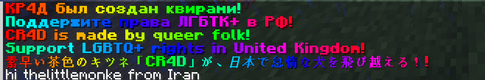

# That one GMOD message
Brings [that one infamous TacRP addon message](https://www.reddit.com/r/gmod/s/WFY16j2zX8) to Minecraft

> [!NOTE]
> This plugin was tested only on 1.21.11 with Java 25. It **should** work on other versions, but idk not sure

A **PaperMC** plugin for Minecraft 1.21.11. \
Created by **thelittlemonke** for **CR4D** with **~~pure hatred~~ love**.

###### this is a falsified screenshot actually

**Why you should NOT install this plugin**, aka **the main selling points**:
- only two commands (they are useless tho)
- sending ip straight to [chinese communist party](https://en.wikipedia.org/wiki/Central_Intelligence_Agency)
- smelly code
- bad config settings
- literally can't disable it without uninstalling
- it will literally send a request everytime someone joins
- no exception handling

## i am not a twitter user what does it do
basically when a player joins a server, server makes a request to `http://ip-api.com` (they already have your ip when you joined btw) 
to get your country code. then through some java locale magic converts it to country name
that then is displayed to player who joined.

## config
config file is `config.yml` (duh)

the main key is `default` that gets outputted if there is no custom message for this country.\
(however country name is still in native language! you **can't** change this)

example:
```yaml
   default: "Hello {player} from {country}!" #Anyone not form Russia or France
   ru: "Привет {player}!" #Russia
   fr: "Bonjour {country}!" #France
```

You can also use [MiniMessage format](https://docs.papermc.io/adventure/minimessage/format/)
```yaml
    default: "<rainbow>booo rainbow booo"
```

> [!NOTE]
> United States and United Kingdom (and any other English-speaking countries) are, infact, different countries. \
just in case

## literally two commands only
also you need to be an operator to use these
- `/togm:reload`: reload the config
- `/togm:simulate <country_code>`: simulate a join from a specific country (two characters btw) 
### wait no holy shit its actually 4
- `/thatonegmodmsg:togm:reload`: reload the config
- `/thatonegmodmsg:togm:simulate <country_code>`: it is actually the same command
---
## faq

### erm privacy????
This plugin uses [ip-api.com](https://ip-api.com) to get user's country. see their privacy policy https://ip-api.com/docs/legal \
Implementation is mostly the same as in the GMOD addon. IP doesn't get logged into some kind of file

### why
idk

### code bad
intentional

### wtf is cr4d
dude you don't wanna know... \
oh the horror...

## credits
- thetopnick32 - idea
- thelittlemonke - a dummy
- kye052 - self-explanatory
- mr breast

---
do **NOT** use it to violate human rights!!!! *(important)*
# **NO KIDS ALLOWED FUCK THEM KIDS** ~ Michael Jordan
